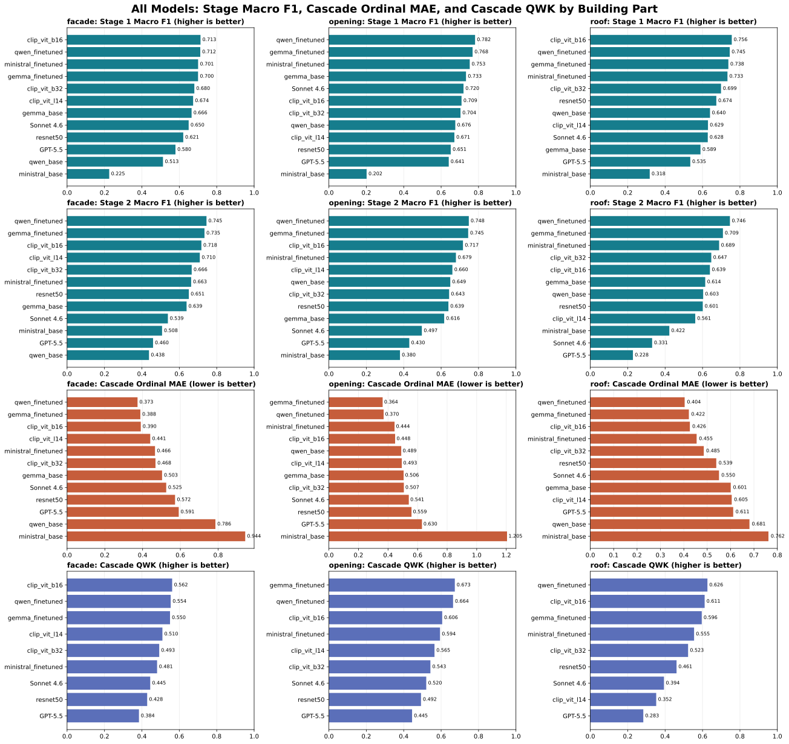

[](https://doi.org/10.5281/zenodo.21497010)

# Blight Inference

Detect residential blight/damage conditions in Detroit from street view imagery (SVI) using fine-tuned vision models.

## 1 Dataset
The blight survey data provided by the Detroit Land Bank Authority (DLBA)

```
=================================================================
Task/Stage     Split        N       cls1      cls2     minority%    
=================================================================
  roof_s1      train     13640      6365     7275       46.7%  
  roof_s1      val        2406      1123     1283       46.7%  
  roof_s1      test       2832      1320     1512       46.6%  

  roof_s2      train      7275      4176     3099       42.6%  
  roof_s2      val        1283       736      547       42.6%  
  roof_s2      test       1512       868      644       42.6%  

  facade_s1    train     13640      3704     9936       27.2%  
  facade_s1    val        2406       654     1752       27.2%  
  facade_s1    test       2832       768     2064       27.1%  

  facade_s2    train      9936      6886     3050       30.7%  
  facade_s2    val        1752      1214      538       30.7%  
  facade_s2    test       2064      1430      634       30.7%  

  open_s1      train     13640      3437    10203       25.2%  
  open_s1      val        2406       606     1800       25.2%  
  open_s1      test       2832       714     2118       25.2%  

  open_s2      train     10203      3948     6255       38.7%  
  open_s2      val        1800       697     1103       38.7%  
  open_s2      test       2118       819     1299       38.7%  
=================================================================
⚠  12 split(s) with minority class < 40%
```

## 2 Benchmark

### Training benchmark on a single GPU - RTX4090.

| Task (stage1 + stage2) | ResNet50 | CLIP ViT-B/16 | CLIP ViT-B/32 | CLIP ViT-L/14 | Gemma-3-4B | Qwen3-VL-8B | Ministral-3-3B |
|---|---:|---:|---:|---:|---:|---:|---:|
| facade | 40m 43s | 37m 22s | 37m 44s | 2h 23m 41s | 163h 09m 23s | 79h 07m 37s | 111h 27m 38s|
| openings | 45m 55s | 31m 45s | 50m 42s | 1h 55m 15s | 167h 57m 29s | 81h 44m 30s | 113h 56m 27s|
| roof | 36m 55s | 1h 17m 38s | 1h 06m 45s | 1h 30m 05s | 156h 52m 01s | 87h 47m 17s | 149h 13m 56s|
| Total | 2h 03m 33s | 2h 26m 45s | 2h 35m 12s | 5h 49m 01s | 487h 58m 54s | 248h 39m 26s| 374h 38m 02s|
|Inference time (second per image)|9.55ms|35.37ms|7.88ms|77.25ms|2.72s|0.24s|0.34s|

## 3 Performance comparison


## 4 Pipeline

1. Download Mapillary street view images for residential parcels (`scripts/svi.py`)
2. Detect houses in the images with Mask2Former (`scripts/detect_house.py`)
3. Merge perspectives and prepare inference inputs (`scripts/prepare_data.py`)
4. Run damage-condition inference with fine-tuned Qwen models (`scripts/inference_qwen.py`)

## 4 Requirements

- OS: 64-bit Linux (Ubuntu 20.04+) or Windows 10/11
- Python: 3.11–3.13 (3.12 recommended)
- CUDA Toolkit: 11.8 or 12.1+ recommended (CUDA 12.8+ required for NVIDIA Blackwell GPUs)
- PyTorch: 2.0+ built with CUDA support matching your drivers
- Core dependencies: `triton`, `xformers`, `bitsandbytes`, `unsloth`

## 6 Installation

### Option 1: conda environment file (recommended)

```sh
conda env create -f environment.yml
conda activate blight_inference
```

> Note: `environment.yml` installs PyTorch from the CUDA 12.1 wheel index. If your system needs a different CUDA build (e.g. `cu128`, `cu130`), edit the `--extra-index-url` line accordingly.

### Option 2: manual setup

```sh
conda create --name blight_inference python=3.12 -y
conda activate blight_inference

# PyTorch with CUDA (pick the index matching your CUDA version)
pip3 install torch torchvision torchaudio --index-url https://download.pytorch.org/whl/cu121

# Remaining dependencies
pip install unsloth transformers bitsandbytes xformers
pip install geopandas urban-worm pandas numpy pillow tqdm huggingface_hub
```

### Verify GPU setup

Check the NVIDIA driver is working (reinstall drivers if this fails):

```sh
nvidia-smi
```

Test that PyTorch sees the GPU:

```python
import torch
print(torch.cuda.is_available())  # should print True
```

## 7 Checkpoints

Fine-tuned Qwen-VL and CLIP ViT B16 checkpoints are hosted on Hugging Face:

| HF repo | URL |
|---|---|
| xiaohaoy/qwen_facade_s1 | https://huggingface.co/xiaohaoy/qwen_facade_s1 |
| xiaohaoy/qwen_facade_s2 | https://huggingface.co/xiaohaoy/qwen_facade_s2 |
| xiaohaoy/qwen_open_s1 | https://huggingface.co/xiaohaoy/qwen_open_s1 |
| xiaohaoy/qwen_open_s2 | https://huggingface.co/xiaohaoy/qwen_open_s2 |
| xiaohaoy/qwen_roof_s1 | https://huggingface.co/xiaohaoy/qwen_roof_s1 |
| xiaohaoy/qwen_roof_s2 | https://huggingface.co/xiaohaoy/qwen_roof_s2 |
| xiaohaoy/blight_clip_ViT | https://huggingface.co/xiaohaoy/xiaohaoy/blight_clip_ViT |


### Download checkpoints

Download all checkpoints with `huggingface_hub`:

```python
from huggingface_hub import snapshot_download

repos = [
    "xiaohaoy/qwen_facade_s1",
    "xiaohaoy/qwen_facade_s2",
    "xiaohaoy/qwen_open_s1",
    "xiaohaoy/qwen_open_s2",
    "xiaohaoy/qwen_roof_s1",
    "xiaohaoy/qwen_roof_s2",
    "xiaohaoy/blight_clip_ViT"
]

for repo_id in repos:
    local_dir = f"models/{repo_id.split('/')[-1]}"
    snapshot_download(repo_id=repo_id, local_dir=local_dir)
    print(f"Downloaded {repo_id} -> {local_dir}")
```

Or with the Hugging Face CLI:

```sh
pip install -U "huggingface_hub[cli]"

for repo in qwen_facade_s1 qwen_facade_s2 qwen_open_s1 qwen_open_s2 qwen_roof_s1 qwen_roof_s2 blight_clip_ViT; do
    hf download "xiaohaoy/${repo}" --local-dir "models/${repo}"
done
```

## 8 Usage

To detect residential damage conditions in Detroit, run the scripts in sequence:

```sh
bash 1_get_mapillary_svi.sh   # download Mapillary SVI for residential parcels
bash 2_detect_house.sh        # detect houses with Mask2Former
bash 3_prepare_data.sh        # merge perspectives, prepare inference inputs
bash 4_inference.sh           # run Qwen-VL damage-condition inference
```

Notes:

- `1_get_mapillary_svi.sh` requires a Mapillary API key (passed to `scripts/svi.py` via `--key`) and input data in `data/` (`buildings.geojson`, `zoning.geojson`).
- Outputs from each stage feed the next; run them in order.

## Acknowledgement

The project was supported by the City of Detroit. We acknowledge the blight survey data provided by the Detroit Land Bank Authority (DLBA).

## Citation
Xiaohao Yang, Tian, A.& North, G. (2026). blight_inference: v1.0 (Version v1.0) [Computer software]. Zenodo. https://doi.org/10.5281/zenodo.21497010
